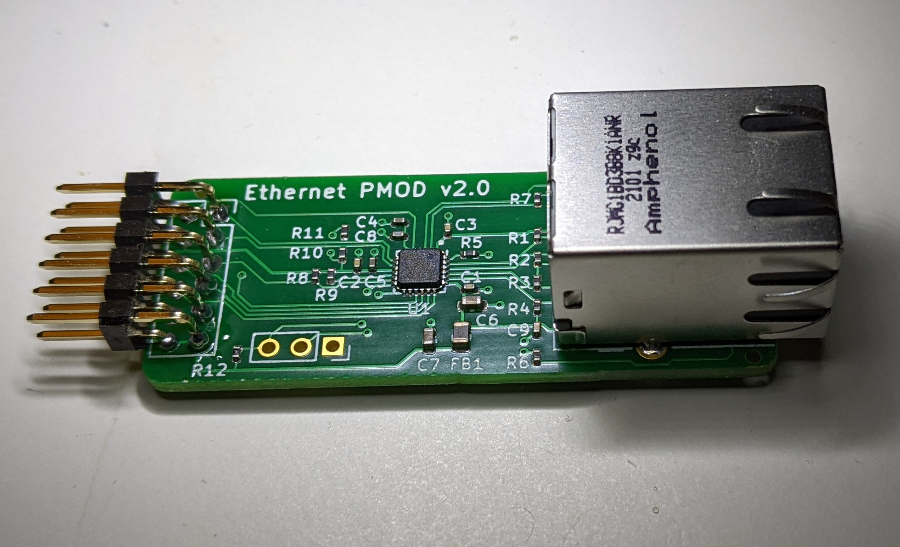
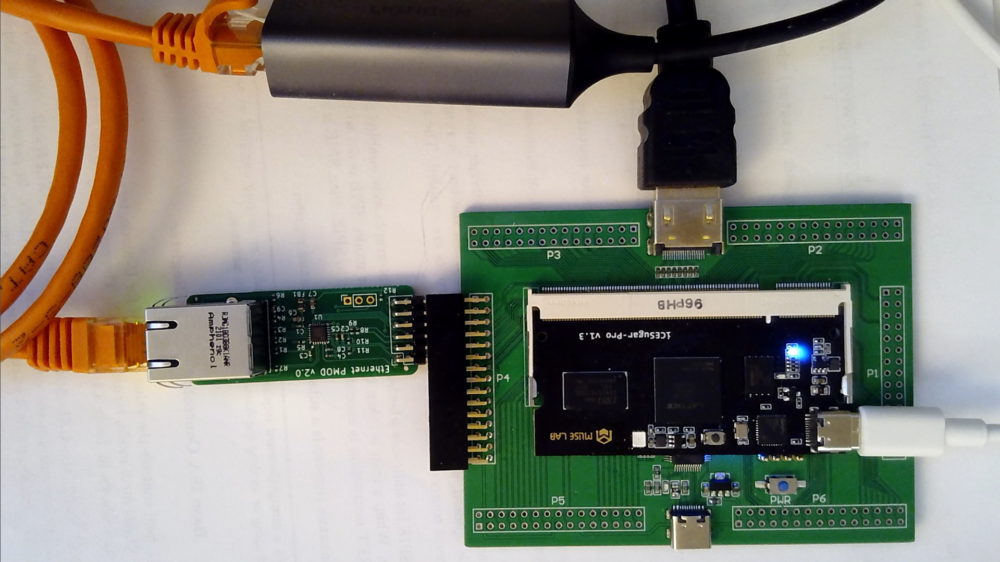
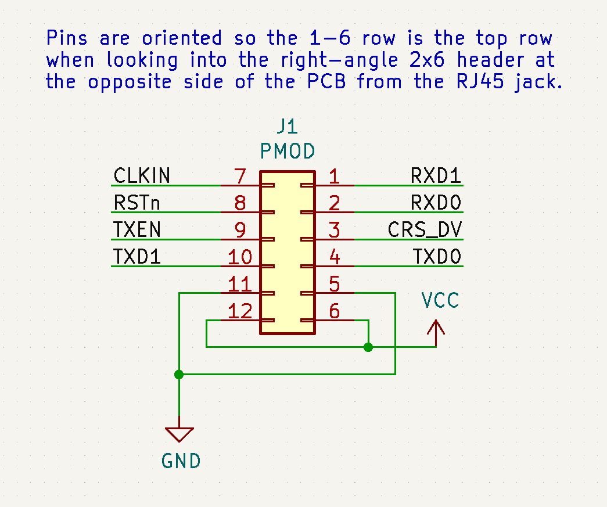

# Ethernet PMOD v2

This PCB is a PMOD (FPGA development board peripheral module) for the
Microchip LAN8720A PHY, to enable 10/100M Ethernet connectivity.

It is configured to accept the necessary 50MHz clock from the FPGA, and
exchanges data using the [RMII standard](https://en.wikipedia.org/wiki/Media-independent_interface#RMII).  A secondary header provides access
to the MDIO/MDC lines to allow access to the management interface.

I have manufactured 10 of these using JLCPCB's PCB fabrication and assembly
service (manually soldering the two throw-hole components myself) and have
used this PMOD successfully with Litex / LiteETH / VexRiscv on a Muse Lab
iCE Sugar Pro FPGA board.

This project is licensed under the [CERN OHL P v2](CERN-OHL-P-v2.txt) Permissive Open Hardware License.

## Design Files and Resources

Original design files are here: [kicad/](kicad/)

Schematic in PDF format here: [export/ethernet-pmod-v2-schematic.pdf](export/ethernet-pmod-v2-schematic.pdf)

Gerbers and CSV files used for a successful JLCPCB order, under [export/jlcpcb/](export/jlcpcb/)

Documentation on the Microchip LAN8720A: https://www.microchip.com/en-us/product/LAN8720A

## Pictures

## PMOD Connector Layout

